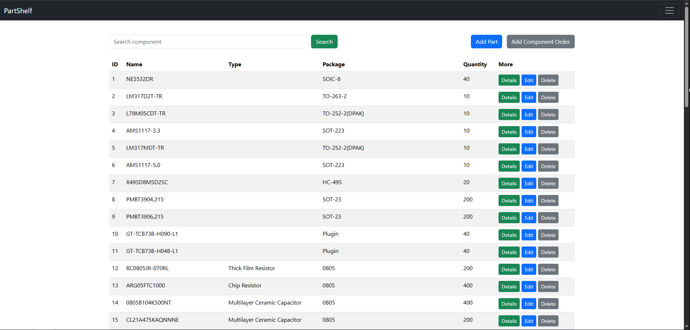
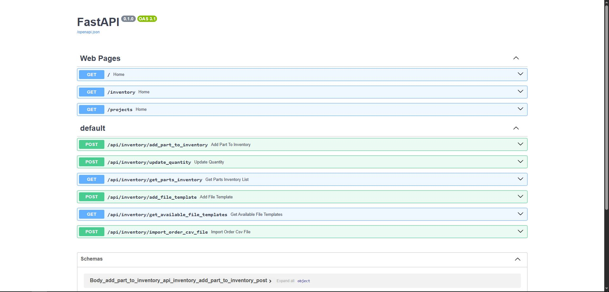

# PartShelf 
**Electronics Inventory Management System**

A modern inventory management web app for electronic components. Easily track parts, quantities, and supplier info. Import from CSVs, auto-extract details like value/type, and integrate smart part registration.

## **Still Under Development**

## Features
### Inventory ManagementB
- Add parts with manufacturer, type, package, and description
- Automatically create related entries if they don’t exist (manufacturer, type, package)
- View list of all parts with quantity
- Update quantity of existing parts
- Delete parts

### CSV Services
- Upload and parse CSV BOM/order files
- Automatically extract component **value** and **type** from the description column
- Custom template support for defining which columns to parse
- Import PCB project BOM and based on inventory entries, generate BOM with only the parts needed to make an order without doing it by hand

### Intelligent Parsing
- App uses Regex-Pandas Library to extract data from imported files and do classification and organization of data for managability

## Technologies Used

### Backend
- **FastAPI** – High-performance web API framework
- **SQLAlchemy** – ORM for managing database models
- **Pydantic** – Data validation and schema definition
- **PostgreSQL / SQLite** – Relational database
- **Python** – Core application logic

### Frontend
- **Jinja2** – Templating for HTML rendering
- **Bootstrap** – Responsive layout and styling

### Tools & Utilities
- **CSV Parser** – Custom logic for extracting rows
- **Regex Parsing** – Extracts value/type from descriptions
- **dotenv** – Environment variable handling
- **Git** – Version control

